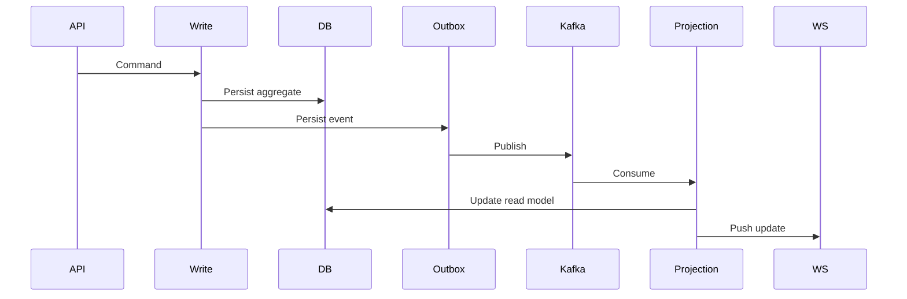

---

# CQRS + Outbox — Décision architecturale centrale

## 🎯 Problème

Dans un système distribué, publier un événement immédiatement après un write pose un risque :

* crash entre write DB et publish Kafka
* double publication
* incohérence entre état persistant et état diffusé
* difficulté à garantir la livraison

Dans un contexte mobile + temps réel, ce risque devient critique.

---

## 🧠 Décision

Mettre en place :

* CQRS strict (séparation write/read)
* Outbox persistée en base
* Dispatcher asynchrone vers Kafka
* Projection dédiée pour le read model
* Push WebSocket après projection

Le write ne publie jamais directement d’événement externe.

---

## 🏗️ Implémentation

### Write side

1. Command handler (ex: `Like.Set`)
2. Modification d’agrégat
3. Persist de l’agrégat
4. Persist d’un event dans la table `outbox`
5. Commit transactionnel unique

La publication Kafka est découplée du cycle HTTP.

---

### Dispatcher

Un process dédié :

* lit la table outbox
* publie vers Kafka
* marque l’événement comme traité
* retry avec backoff si échec

---

### Projection

Un consumer Kafka :

* consomme l’événement
* met à jour le read model
* pousse un événement WebSocket
* inclut `{count, me, version, serverTime}`

---

## 🔒 Garanties obtenues

* Atomicité write + event persisté
* Idempotence via `commandId`
* Delivery at-least-once
* Reconstruction possible du read model
* Isolation du domaine métier

---

## ⚖️ Trade-offs assumés

* Complexité supérieure
* Eventual consistency
* Latence légèrement accrue
* Nécessité d’observabilité

---

## 🧩 Pourquoi ne pas faire plus simple ?

Un CRUD classique :

* write
* publish
* update read

fonctionne en local, mais casse en production :

* crash mid-flight
* scaling horizontal
* déploiement multi-instance
* résilience réseau

Le pattern CQRS + Outbox rend ces scénarios maîtrisables.

---

## 📊 Vue simplifiée

---

## 🏁 Résultat

Un système :

* résilient
* scalable
* cohérent
* mobile-friendly
* prêt pour la production

---
