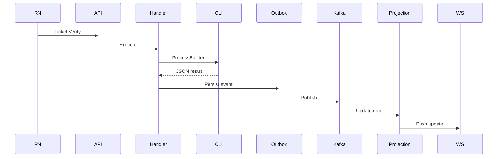

---

# Ticket Verification — Intégration CLI + Backend

## 🎯 Problème

La vérification d’un ticket nécessite :

* OCR externe
* parsing texte
* validation métier
* gestion d’erreurs imprévisibles

Plutôt que d’intégrer une librairie native instable dans la JVM,
le choix a été fait d’isoler le traitement OCR dans un **exécutable CLI dédié**.

---

## 🧠 Décision

Architecture retenue :

* CLI isolé (stdout JSON only)
* Spring Boot appelle la CLI via `ProcessBuilder`
* Communication via stdin / stdout
* Timeout strict
* Parsing JSON avec Jackson
* Exit codes explicites

Cette séparation permet :

* isolation des dépendances OCR
* meilleure testabilité
* meilleure stabilité
* gestion claire des erreurs

---

## 🏗️ Implémentation

### 1. Côté CLI

Contraintes imposées :

* stdout contient uniquement du JSON valide
* stderr réservé aux logs
* exit code ≠ 0 en cas d’erreur
* validation stricte des inputs

Exemple de sortie :

```json
{
  "status": "VALID",
  "coffeeName": "Fragments Coffee",
  "amount": 4.50,
  "timestamp": "2026-01-21T10:15:00Z"
}
```

---

### 2. Côté Spring Boot

Flow :

1. Construction du `ProcessBuilder`
2. Envoi de l’OCR brut via stdin UTF-8
3. Lecture stdout
4. Lecture stderr (logs internes)
5. Timeout configurable
6. Vérification exit code
7. Parsing JSON avec Jackson

En cas de :

* timeout → exception métier
* exit code ≠ 0 → erreur contrôlée
* JSON invalide → exception explicite

---

## 🔄 Intégration dans CQRS

1. Command `Ticket.Verify`
2. Handler appelle le wrapper CLI
3. Résultat persistant
4. Event Outbox généré
5. Projection mise à jour
6. WebSocket push vers le client

---

## 📊 Vue simplifiée



---

## 🔒 Garanties obtenues

* Isolation du moteur OCR
* Timeout maîtrisé
* Gestion d’erreurs explicite
* Pas de blocage JVM
* Intégration testable en TDD
* Contrat clair entre composants

---

## ⚖️ Trade-offs assumés

* Coût d’un process externe
* Complexité supplémentaire
* Besoin de supervision
* Gestion fine des flux stdout/stderr

---

## 🏁 Résultat

Un système :

* robuste
* isolé
* testable
* maîtrisé
* prêt pour la production

---
