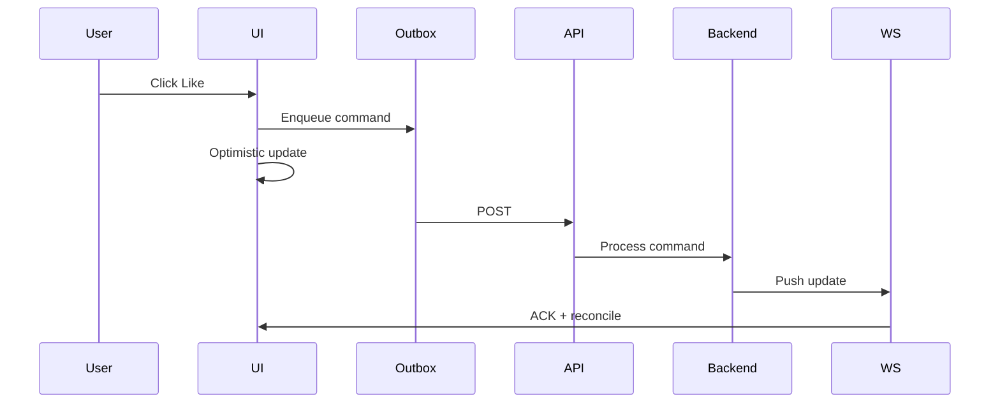

---

# Outbox Client — Résilience côté mobile

## 🎯 Problème

Dans un environnement mobile :

* le réseau est instable
* les connexions WebSocket peuvent tomber
* les requêtes HTTP peuvent échouer
* l’utilisateur peut passer offline
* l’application peut être mise en background

Un simple `POST` immédiat n’est pas suffisant.

---

## 🧠 Décision

Implémenter une **Outbox côté client**.

Chaque action utilisateur est :

1. Transformée en commande sérialisable
2. Persistée localement
3. Exécutée de manière asynchrone
4. Retentée automatiquement si échec

---

## 🏗️ Implémentation

### 1. Enqueue

Lorsqu’un utilisateur clique sur "Like" :

* création d’une commande `Like.Set`
* ajout d’un `commandId`
* persist dans l’Outbox locale
* mise à jour optimiste du state Redux

---

### 2. Dispatcher

Un orchestrateur :

* traite les commandes en file
* applique un backoff exponentiel (cap 60s + jitter)
* suspend en background
* reprend en foreground ou reconnexion réseau

---

### 3. Idempotence

Chaque commande contient :

* `commandId`
* éventuellement `draftId`

Le backend peut ainsi :

* ignorer les doublons
* traiter les retries sans effet secondaire

---

### 4. Squash intelligent

Les commandes `Like.Set` successives sont fusionnées :

```
Like(true)
Like(false)
Like(true)
```

devient :

```
Like(true)
```

Ce mécanisme évite :

* surcharge réseau
* conflits inutiles
* pollution du backend

---

## 🔄 Synchronisation avec le serveur

Après traitement côté backend :

1. Projection mise à jour
2. WebSocket push vers le client
3. Réconciliation avec le state local
4. Suppression de la commande de l’Outbox

---

## 📊 Vue simplifiée



---

## 🔒 Garanties obtenues

* Expérience fluide même offline
* Aucune perte d’action utilisateur
* Retry automatique
* Cohérence éventuelle maîtrisée
* Résilience aux crashs app

---

## ⚖️ Trade-offs assumés

* Complexité accrue côté client
* Gestion fine du cycle de vie (background/foreground)
* Nécessité d’un protocole clair avec le backend

---

## 🏁 Résultat

Un client mobile :

* robuste
* résilient
* orienté production
* compatible avec un backend distribué

---
